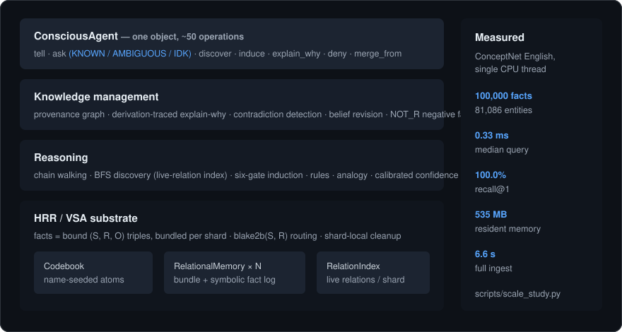

# RCK — Resonant Cognitive Kernel

> **An auditable, hallucination-free alternative to LLMs.**
> RCK reasons in explicit chains, learns by deriving (not retraining),
> runs on CPU, and shows you the receipts for every answer.
> 100,000 real-world facts in 535 MB: sub-millisecond queries,
> 100.0% recall@1, one CPU thread.

[](https://github.com/NORTHTEKDevs/rck/actions/workflows/test.yml) [](#) [](#) [](LICENSE) [](CHANGELOG.md)

---

## About this work

RCK was designed and built by Kristian Baer in close collaboration
with Anthropic's Claude. Architectural choices were made by the author
after research; implementation and drafting were AI-assisted. Every
empirical claim in the [paper](papers/rck-architecture/) is
reproducible from this repo — each number in §5 traces to a script in
`scripts/` and a JSON output in `data/`. The author welcomes scrutiny,
issues, and corrections.

---

## What is this

RCK is a working AI that **isn't a language model**.

Instead of one giant black-box neural net, RCK stores knowledge as
discrete facts in a hyperdimensional vector substrate (HRR / VSA), and
reasons over them with an explicit, inspectable pipeline:
multi-hop chains, rule extraction, fact induction, conflict resolution,
counterfactual exploration, all auditable through a provenance graph.

The result is an agent that:

| | LLM | RCK |
|---|---|---|
| Says "I don't know" when it doesn't | ✗ | ✓ |
| Shows you why it knows something | ✗ | ✓ |
| Lets you edit a single fact | ✗ | ✓ |
| Resolves contradictions between sources | ✗ | ✓ |
| Learns from a new fact in O(1) | ✗ | ✓ |
| Runs on a laptop CPU | ✗ | ✓ |
| Costs ~$0 to operate | ✗ | ✓ |
| Reasons 30+ hops deep | ✗ | ✓ |

It's small (126 modules, ~18.8k lines of plain numpy Python). It's
testable (**757 passing tests**). It's research-grade but
production-shaped.

<p align="center">
  
</p>

---

## Install

```bash
pip install git+https://github.com/NORTHTEKDevs/rck
```

> Note: the `rck` name on PyPI belongs to an unrelated
> bioinformatics project, so install from the repository. If/when
> this package is published to PyPI it will ship as `rck-kernel`
> (the import name stays `rck`).

For development:

```bash
git clone https://github.com/NORTHTEKDevs/rck
cd rck
pip install -e ".[dev]"
pytest -q
```

Optional extras: `[mcp]` for the MCP server, `[polisher]` for the
PyTorch surface-form polisher. On a base install their test modules
skip cleanly; install `".[dev,mcp,polisher]"` to run the full
757-test suite.

---

## 60-second demo

```python
from rck.conscious_agent import ConsciousAgent

agent = ConsciousAgent(expected_facts=1000)

# Tell the agent things.
agent.tell("dog", "isa", "mammal")
agent.tell("mammal", "isa", "animal")
agent.tell("dog", "has", "fur")

# Ask with explicit "I don't know" detection.
res = agent.ask_with_idk({"S": "dog", "R": "isa"}, "O")
print(res.verbalize())
# -> "I'm confident: the answer is 'mammal' (score 1.00)."

# Reason 3 hops deep with a discovered chain.
spec = agent.discover("dog", "animal", max_depth=3)
print(spec["relations"])
# -> ['isa', 'isa']

# Induce a new direct fact and explain how it was derived.
induced = agent.induce("dog", "animal")
print(f"learned: ({induced.subject}, {induced.relation}, {induced.obj})")
print(agent.explain_why("dog", "isa", "animal").verbalize())
```

More demos: `examples/`. The flagship one is
`examples/v14_full_stack_demo.py`, which exercises every major
capability on a real 716-fact commonsense KB.

---

## What it can do

### Reasoning
- **Direct retrieval** with calibrated `KNOWN / AMBIGUOUS / IDK` states.
- **Multi-hop chain walking** — argmax answers stay correct to 50+
  hops; the default geometric-mean rule reports moderate-or-better
  confidence to 30+ hops, and the v15.2 `calibrated_product` rule
  reports honest probabilities (a clean 50-hop chain ≈ 0.98,
  decaying with length).
- **Chain discovery** via BFS over the HRR graph (~21ms on the
  bundled 716-fact KB, 30ms median on ConceptNet-100k; a per-shard
  live-relation index cuts 31-66% of queries, 1.4-2.8× faster).
- **Scale** (v15.3): 100,000 real ConceptNet facts — 6.6s ingest,
  100.0% recall@1, 0.33ms median query, 535 MB, single thread.
  Shard-local cleanup makes per-query cost independent of
  vocabulary size (paper §4.5, §5.6).
- **Fact induction**: confident chains become new direct edges behind
  a six-gate filter stack — 31/31 manually-validated inductions on
  the 400-probe study (the earlier v15.0 "~87% precision" framing
  measured HRR-roundtrip stability, not semantic correctness, and is
  retracted and decomposed honestly in the paper, §5.1).
- **Cascading induction**: iterate to fixed point.
- **Rule extraction**: turn repeated patterns into symbolic universal
  rules.
- **Rule instantiation** (N-clause bodies, forward chaining).
- **Rule composition**: `R1; R2` → longer rules without new searches.
- **Analogical reasoning**: `A:B::C:?` with calibrated Bayesian
  probabilities. 93.9% accuracy on the commonsense benchmark.
- **Causal chains**: downstream effects and root-cause walks.
- **Counterfactuals**: `with agent.counterfactual([...])` for
  what-if exploration that rolls back on exit.
- **Set reasoning**: intersection, union, difference across constraints.

### Knowledge management
- **Provenance graph** for every fact: who told us, when, why.
- **`explain_why(s, r, o)`** returns a recursive derivation tree
  back to user-asserted facts.
- **Contradiction detection** for functional relations + direct negation
  collisions.
- **Belief revision** with source-priority resolution
  (`user > multi > external > induced > rule > unknown`).
- **Negative facts** (`agent.deny(...)`) — positive certainty about
  non-membership, distinct from IDK.
- **Negation propagation** through `isa` / `partof` lifting relations.
- **Hierarchical abstraction**: lift shared sibling facts to the parent.
- **Fact pruning** by confidence with user-fact protection.

### Memory & meta
- **Episodic query memory** with drift detection and replay.
- **Calibration tally**: `record_truth(...)` feeds ground truth back
  into per-relation accuracy stats.
- **Score calibration** (v15.2): isotonic cosine→P(correct) mapping
  (`rck.score_calibration`) — raw cosines are similarity features,
  not probabilities (held-out Brier 0.568 raw vs 0.0038 calibrated).
- **Chain cache** (LRU, versioned, auto-invalidated on KB writes).
- **Skill clustering** + **promotion to rules**.
- **Episodic consolidation** (a "dreaming" pass that pre-warms stable
  query paths).
- **Persistence**: `agent.save_state(dir)` writes skills, provenance,
  query memory; `load_state` restores them.

### Multi-agent
- **Federated merge**: `agent.merge_from(other)` combines two agents'
  KBs, skills, and provenance.
- **Consensus voting** across multiple agents with majority /
  confidence / both modes.
- **Diff**: see what one agent knows that another doesn't.

### Analytics
- **`agent.status_report()`** — full state dashboard.
- **`agent.find_gaps(subject)`** — relations peers have but subject is
  missing.
- **`agent.similar_entities(subject)`** — Jaccard overlap of (R, O)
  attribute sets.
- **`agent.concept_density()`** — fact-count histogram + stub detection.
- **`agent.relation_cooccurrence()`** — which relations cluster together.
- **`agent.rank_subjects()`** — composite importance ranking.
- **`agent.shard_balance()`** — capacity-cliff monitoring.

### Operations
- **`agent.maintain(checkpoint_dir=...)`** — one-call nightly pass:
  cascade induction → rule cascade → negation propagation → conflict
  resolution → skill promotion → episodic consolidation → cache
  pre-warm → optional checkpoint.
- **`agent.what_if_user_says(text)`** — Open IE → counterfactual
  preview → rollback. "Should I tell the agent X?"
- **`agent.what_changes(facts)`** — same preview, structured input.
- **`agent.delta_replay(facts)`** — step-by-step what each new fact
  unlocks.

---

## How it works (one paragraph)

Each entity and relation gets a high-dimensional bipolar vector
(D=4096 by default). Facts `(S, R, O)` are stored as multiplicative
bindings of role-vector ⊗ value-vector, bundled additively into a
per-shard memory tensor. Retrieval is bind-then-cleanup: multiply the
memory tensor by the role bindings of the known slots, then look up
the result in the codebook. Sharding by `hash(S || R) % n_shards`
keeps per-shard fact counts under the capacity cliff. Higher layers
build on this substrate: chain walker, rule store, provenance graph,
query memory, and the conscious agent that stitches them together.

For depth: `docs/design/v14-narrative.md` is the architectural
rollup. `docs/guide/` has user-facing tutorials.

---

## Performance

Numbers measured on the bundled commonsense KB (716 facts, D=4096,
16 shards, Python 3.11+, single CPU thread); latency is
machine-dependent:

| Operation | Time |
|---|---|
| Direct retrieval | <1 ms |
| 2-hop chain discovery | ~21 ms |
| 50-hop chain walk | ~25 ms |
| Cascading induction (4 rounds) | ~3 s |
| `agent.maintain()` full pass | ~5 s |

At scale (ConceptNet English, single CPU thread, auto-sharded —
`scripts/scale_study.py`, subset committed in `data/`):

| Facts | Ingest | RSS | recall@1 | Query median | 2-hop discovery |
|---:|---:|---:|---:|---:|---:|
| 10,000 | 0.7 s | 135 MB | 99.9% | 0.22 ms | 83% @ 5 ms |
| 30,000 | 2.4 s | 253 MB | 100.0% | 0.35 ms | 90% @ 18 ms |
| 100,000 | 6.6 s | 535 MB | 100.0% | 0.33 ms | 97% @ 30 ms |

Query cost is independent of vocabulary size (shard-local cleanup,
v15.3): 100,000 facts answers as fast as 700. 100,000 facts is the
largest publicly benchmarked configuration; millions should follow
the same shard arithmetic but are unverified.

---

## Limits & honest caveats

* **Surface fluency** is intentionally lightweight. The polisher
  (`rck.polisher`) is a small transformer trained on a synthetic
  paraphrase corpus; for now, RCK answers in slightly stilted but
  grammatical sentences. It's not a chatbot.
* **Ingestion at scale**. The bundled Open IE extractor is rule-based.
  Eating Wikipedia means plugging in a better extractor; see the
  ingestion answer in `docs/guide/07-faq.md`.
* **No "knows the whole internet" out of the box**. You feed it facts
  and it grows. The cost gap vs LLMs is 4-5 orders of magnitude.
* **Capacity cliff** at ~80 facts/shard for D=4096. Auto-shard sizing
  handles this; you just have to call `expected_facts=N` at agent
  construction or call `agent.shard_balance()` for diagnostics.
* **Stories are hard**. RCK is good at structured knowledge, not at
  narrative or creative writing. That's not what it's for.

---

## Project layout

```
rck/                   # the library (126 modules)
  conscious_agent.py   # the agent that wires everything together
  knowledge_base.py    # sharded HRR memory + live-relation index
  chain_walker.py
  chain_discover.py
  chain_induction.py   # with the filter stack
  rule_extraction.py
  rule_instantiation.py
  rule_cascade.py
  rule_composition.py
  analogy.py
  causal.py
  contradiction.py
  belief_revision.py
  explain_why.py
  provenance.py
  query_memory.py
  ...
docs/
  guide/               # tutorials (start here)
  design/              # architectural design docs
examples/              # runnable demos
tests/                 # 757 tests
scripts/               # benchmark + ingestion scripts
```

---

## Status

* **v15.2.0** — current. 757 passing tests. API stable.
* Active research. PRs welcome (see `CONTRIBUTING.md`).
* MIT licensed.

---

## Citation

If you use RCK in research, please cite (or use GitHub's
"Cite this repository" button, backed by `CITATION.cff`):

```bibtex
@software{rck2026,
  author  = {Baer, Kristian},
  title   = {RCK: Resonant Cognitive Kernel},
  year    = {2026},
  version = {15.3.0},
  url     = {https://github.com/NORTHTEKDevs/rck}
}
```

---

## Credits

Built by Kristian Baer.
Standing on the shoulders of: Pentti Kanerva (HDC), Tony Plate (HRR),
Pei Wang (NARS), and decades of symbolic-AI research that didn't lose
the thread when LLMs ate the field.

Frostbyte Digital, Anchorage, Alaska.
